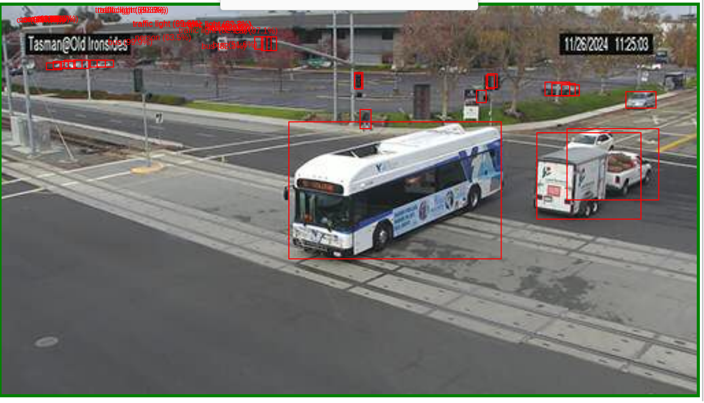

# Santa Clara Real Time Traffic Camera Streamer
The following repo contains a program that streams traffic data from santa clara's open traffic cameras. It streams the image(a very small binary file) into a fluvio topic. If you run sdf dataflow, you can apply a hugging face yolo transformation that does object detection. 


## Running the example
A makefile is there for u to run 
1. `make up` will generate all the required docker images
2. visit [localhost:5001](localhost:5001)
   
*You may need to update the huggingface api key found in `sdf/dataflow.yaml`. There is one provided, it will last until it doesn't*
```
line 70 sdf/dataflow.yaml: let token = "<your key>";
```

## Topics
1. `traffic-camera` contains the raw images streamed
2. `traffic-boxes` contains the bounding boxes of the objects detected by yolos


## To clean
1. `make clean` will clean the docker and the volumes


